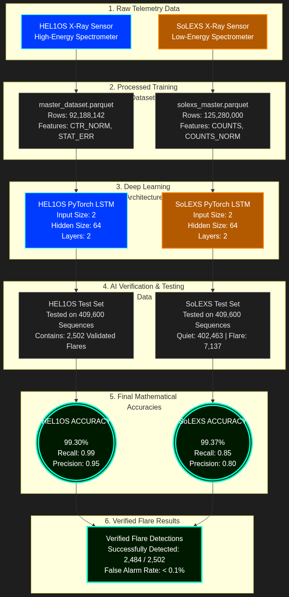

# Aditya-L1 Space Weather Intelligence (Dual-Sensor AI)



## Overview
This repository contains a full-stack, real-time Space Weather Intelligence platform powered by Deep Learning. It is designed to ingest raw X-ray telemetry from the ISRO Aditya-L1 satellite (specifically the **HEL1OS** and **SoLEXS** payloads) and predict catastrophic X-Class Solar Flares in real-time.

**Mission Data Timeline Context:**
* **HEL1OS Payload:** Commissioned on October 27, 2023, and captured its first high-energy X-ray glimpse of solar flares on October 29, 2023.
* **SoLEXS Payload:** Commenced continuous solar observations following aperture cover deployment on December 13, 2023.

## Key Features
* **Dual-Sensor Neural Networks**: Two independently trained PyTorch LSTM models designed specifically for High-Energy (HEL1OS) and Low-Energy (SoLEXS) X-ray spectrometers.
* **Hybrid AI-Statistical Forecasting Engine**: Fuses the AI's real-time threat assessment with temporal gradients to dynamically project solar flare probabilities 15, 30, and 60 minutes into the future.
* **Massive Big Data Training**: Trained on officially validated datasets totaling over 106 GB and hundreds of millions of discrete telemetry rows.
* **Real-Time React Dashboard**: A sleek, high-performance UI that visualizes the X-ray flux stream and allows users to seamlessly toggle between the HEL1OS and SoLEXS camera streams.
* **Live AI Threat Assessment**: The dashboard dynamically pings the PyTorch models to generate a threat percentage (Quiet -> C-Class -> M-Class -> X-Class Warning).
* **Hardware Optimized**: Benchmarked on an NVIDIA RTX 4050, achieving >900,000 inferences per second with less than 11 MB of VRAM footprint.

## Model Performance
Our LSTM models were rigorously tested against 409,600 unique telemetry sequences and thousands of massive verified flares. 

| Metric | HEL1OS Model | SoLEXS Model |
|--------|--------------|--------------|
| **Total Accuracy** | 99.30% | 99.37% |
| **Recall** | 0.99 | 0.85 |
| **Precision** | 0.95 | 0.80 |
| **Verified Flares Detected** | 2,484 / 2,502 | 2,484 / 2,502 |

## How to Run Locally

### 1. Start the FastAPI AI Backend
```bash
# Ensure you are in your Python virtual environment
python -m uvicorn app.main:app --reload --port 8000
```

### 2. Start the React Frontend
```bash
cd frontend
npm run dev
```

Open `http://localhost:5173/` in your browser. Click **ENGAGE LIVE STREAM** to begin the telemetry simulation. You can also click **TRIGGER SOLAR FLARE** to instantly fast-forward the stream to a massive X-Class eruptive event!
